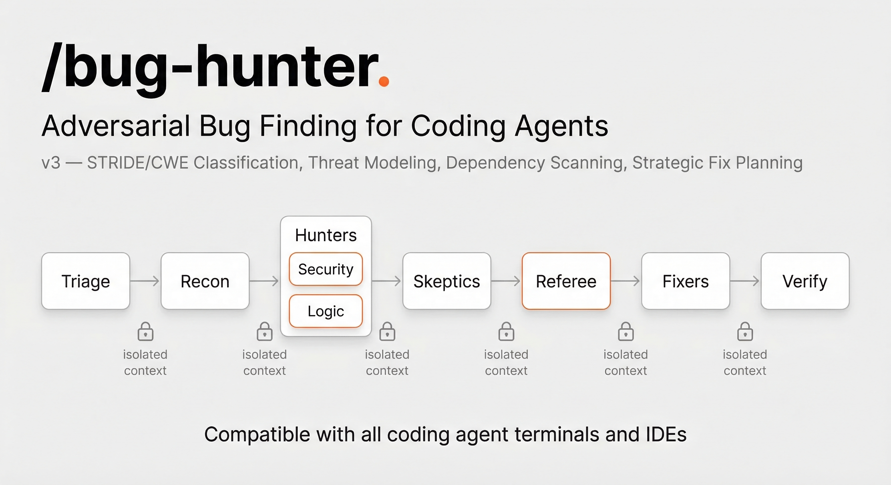
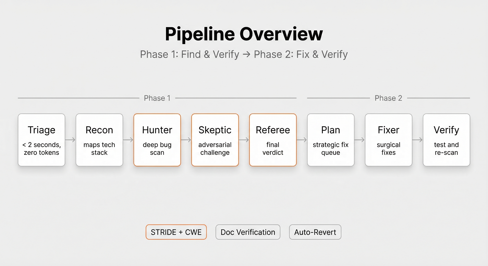
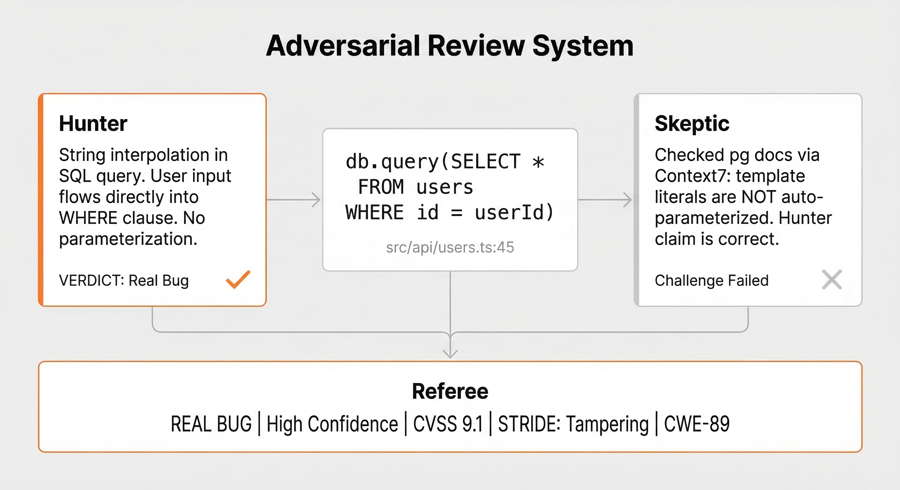
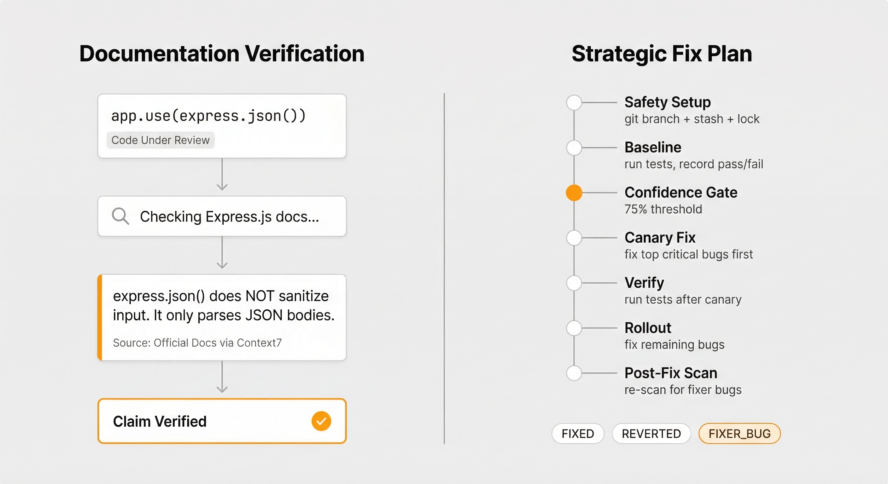
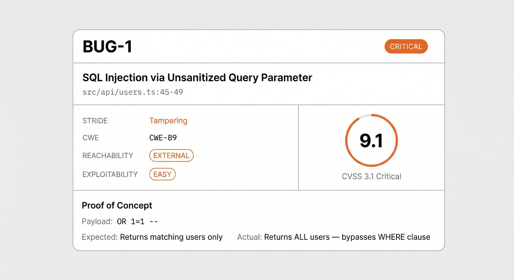

<p align="center">
  
</p>

<h1 align="center">🐛 Bug Hunter</h1>
<p align="center"><strong>AI-powered adversarial bug finding that argues with itself to surface real vulnerabilities — and auto-fixes them safely.</strong></p>
<p align="center">
  <a href="#quick-start">Quick Start</a> ·
  <a href="#how-the-adversarial-pipeline-works">How It Works</a> ·
  <a href="#features">Features</a> ·
  <a href="#security-classification-stride-cwe-cvss">Security Classification</a> ·
  <a href="#strategic-fix-planning-and-safe-auto-fix">Auto-Fix</a> ·
  <a href="#supported-languages-and-frameworks">Languages</a> ·
  <a href="#install">Install</a>
</p>

---

## Table of Contents

- [What Is Bug Hunter](#what-is-bug-hunter)
- [The Problem with AI Code Review](#the-problem-with-ai-code-review)
- [How the Adversarial Pipeline Works](#how-the-adversarial-pipeline-works)
  - [Pipeline Architecture Overview](#pipeline-architecture-overview)
  - [Adversarial Debate — Hunter vs Skeptic vs Referee](#adversarial-debate--hunter-vs-skeptic-vs-referee)
  - [Agent Incentive Scoring System](#agent-incentive-scoring-system)
- [Quick Start](#quick-start)
  - [Installation](#installation)
  - [Basic Usage](#basic-usage)
  - [Branch Diff and Staged File Scanning](#branch-diff-and-staged-file-scanning)
  - [Full Security Audit Mode](#full-security-audit-mode)
- [Features](#features)
  - [Zero-Token Triage — Instant File Classification](#zero-token-triage--instant-file-classification)
  - [Deep Bug Hunting — Runtime Behavioral Analysis](#deep-bug-hunting--runtime-behavioral-analysis)
  - [Official Documentation Verification via Context7](#official-documentation-verification-via-context7)
  - [Adversarial Skeptic with 15 Hard Exclusion Rules](#adversarial-skeptic-with-15-hard-exclusion-rules)
  - [Few-Shot Calibration for Precision Tuning](#few-shot-calibration-for-precision-tuning)
  - [Automatic Codebase Scaling Strategies](#automatic-codebase-scaling-strategies)
- [Security Classification — STRIDE, CWE, and CVSS](#security-classification-stride-cwe-cvss)
  - [STRIDE Threat Categorization](#stride-threat-categorization)
  - [CWE Weakness Identification](#cwe-weakness-identification)
  - [CVSS 3.1 Severity Scoring](#cvss-31-severity-scoring)
  - [Enriched Referee Verdicts with Proof of Concept](#enriched-referee-verdicts-with-proof-of-concept)
- [Threat Modeling with STRIDE](#threat-modeling-with-stride)
- [Dependency CVE Scanning](#dependency-cve-scanning)
- [Strategic Fix Planning and Safe Auto-Fix](#strategic-fix-planning-and-safe-auto-fix)
  - [Phase 1 — Safety Setup and Git Branching](#phase-1--safety-setup-and-git-branching)
  - [Phase 2 — Test Baseline Capture](#phase-2--test-baseline-capture)
  - [Phase 3 — Confidence-Gated Fix Queue](#phase-3--confidence-gated-fix-queue)
  - [Phase 4 — Canary Rollout Strategy](#phase-4--canary-rollout-strategy)
  - [Phase 5 — Post-Fix Verification and Re-Scan](#phase-5--post-fix-verification-and-re-scan)
  - [Fix Status Reference](#fix-status-reference)
  - [Documentation-Verified Fixes](#documentation-verified-fixes)
- [Structured JSON Output for CI/CD Integration](#structured-json-output-for-cicd-integration)
- [Output Files Reference](#output-files-reference)
- [Supported Languages and Frameworks](#supported-languages-and-frameworks)
- [CLI Flags Reference](#cli-flags-reference)
- [Self-Test and Validation](#self-test-and-validation)
- [Project Structure](#project-structure)
- [Install](#install)
- [License](#license)

---

## What Is Bug Hunter

Bug Hunter is an **automated adversarial code auditing system** that uses multiple AI agents working together — and against each other — to find real bugs in your codebase. It functions as a team of expert security reviewers who cross-check each other's work through structured debate.

Instead of a single AI scanning your code and flooding you with false alarms, Bug Hunter runs an **adversarial multi-agent pipeline**: one agent hunts for bugs, a second agent tries to disprove them, and a third agent delivers an independent final verdict. Only bugs that survive all three stages appear in your report.

Bug Hunter works with **any AI coding agent** — [Pi](https://github.com/mariozechner/pi-coding-agent), Claude Code, Codex, Cursor, Windsurf, or anything that can read files and run shell commands.

---

## The Problem with AI Code Review

Traditional AI code review tools suffer from two persistent failure modes:

1. **False positive overload.** Developers waste hours triaging "bugs" that aren't real — the code is fine, or the framework already handles the edge case. This erodes trust and leads teams to ignore automated findings entirely.

2. **Fixes that introduce regressions.** Automated fixers often break working code because they lack full context — they don't understand the test suite, the framework's implicit behaviors, or the upstream dependencies.

Bug Hunter eliminates both problems:

- **False positives** are filtered through adversarial debate. The Hunter finds bugs, the Skeptic tries to disprove them with counter-evidence, and the Referee delivers an independent verdict — replicating the dynamics of a real multi-reviewer code review, but automated and reproducible.

- **Regressions from fixes** are prevented by a strategic fix pipeline that captures test baselines, applies canary rollouts, checkpoints every commit, auto-reverts failures, and re-scans fixed code for newly introduced bugs.

---

## How the Adversarial Pipeline Works

### Pipeline Architecture Overview

<p align="center">
  
</p>

The pipeline processes your code through eight sequential stages. Each stage feeds structured output to the next, creating a chain of evidence that eliminates noise and surfaces only confirmed, real bugs.

```
Your Code
    ↓
🔍 Triage          — Classifies files by risk in <2s, zero AI cost
    ↓
🗺️  Recon           — Maps tech stack, identifies high-risk attack surfaces
    ↓
🎯 Hunter          — Deep behavioral scan: logic errors, security holes, race conditions
    ↓                  ↕ verifies claims against official library documentation
🛡️  Skeptic         — Adversarial challenge: attempts to DISPROVE every finding
    ↓                  ↕ verifies dismissals against official documentation
⚖️  Referee         — Independent final judge: re-reads code, delivers verdict
    ↓
📋 Report          — Confirmed bugs only, with severity, STRIDE/CWE tags, CVSS scores
    ↓
📝 Fix Plan        — Strategic plan: priority ordering, canary rollout, safety gates
    ↓
🔧 Fixer           — Executes fixes sequentially on a dedicated git branch
    ↓                  ↕ checks documentation for correct API usage in patches
✅ Verify          — Tests every fix, reverts failures, re-scans for fixer-introduced bugs
```

### Adversarial Debate — Hunter vs Skeptic vs Referee

<p align="center">
  
</p>

The core innovation is **structured adversarial debate** between agents with opposing incentives. This mirrors how real security teams operate — a penetration tester finds vulnerabilities, a defender challenges the findings, and a security architect makes the final call.

Each agent independently reads the source code. No agent trusts another's analysis — they verify claims by re-reading the actual code and checking official documentation.

### Agent Incentive Scoring System

| Agent | Earns Points For | Loses Points For |
|-------|-----------------|-----------------|
| 🎯 **Hunter** | Reporting real, confirmed bugs | Reporting false positives |
| 🛡️ **Skeptic** | Successfully disproving false positives | Dismissing real bugs (2× penalty) |
| ⚖️ **Referee** | Accurate, well-reasoned final verdicts | Blind trust in either Hunter or Skeptic |

This scoring creates a **self-correcting equilibrium**. The Hunter doesn't flood the report with low-quality findings because false positives reduce its score. The Skeptic doesn't dismiss everything because missing a real bug incurs a double penalty. The Referee can't rubber-stamp — it must independently verify.

---

## Quick Start

### Installation

```bash
# Clone into your agent's skills directory
git clone https://github.com/codexstar69/bug-hunter.git ~/.agents/skills/bug-hunter
```

**Requirements:** Node.js 18+ (for triage and helper scripts). No other dependencies.

**Compatible agents:** Pi, Claude Code, Codex, Cursor, Windsurf, or any AI agent with file-reading and shell-command tools.

### Basic Usage

```bash
# Scan your entire project and auto-fix confirmed bugs
/bug-hunter

# Scan a specific directory
/bug-hunter src/

# Scan a single file
/bug-hunter lib/auth.ts

# Report only — no code changes
/bug-hunter --scan-only src/

# Find and fix bugs, but ask before each fix
/bug-hunter --fix --approve src/
```

### Branch Diff and Staged File Scanning

```bash
# Scan only files changed in a feature branch (vs main)
/bug-hunter -b feature-xyz

# Scan branch diff against a specific base branch
/bug-hunter -b feature-xyz --base dev

# Scan staged files before committing (pre-commit hook integration)
/bug-hunter --staged
```

### Full Security Audit Mode

```bash
# Full audit: dependency CVE scanning + STRIDE threat modeling
/bug-hunter --deps --threat-model src/

# Iterative audit for large codebases — runs until 100% critical coverage
/bug-hunter --loop --deps --threat-model src/
```

---

## Features

### Zero-Token Triage — Instant File Classification

Before any AI agent runs, a lightweight Node.js script (`scripts/triage.cjs`) scans your entire codebase in **under 2 seconds**. It classifies every file by risk level — CRITICAL, HIGH, MEDIUM, LOW, or CONTEXT-ONLY — computes a token budget, and selects the optimal scanning strategy.

This means **zero wasted AI tokens** on file discovery and classification. A 2,000-file monorepo is triaged in the same time as a 10-file project.

The triage output drives every downstream decision: which files the Hunter reads first, how many parallel workers to spawn, and whether loop mode is needed for complete coverage.

### Deep Bug Hunting — Runtime Behavioral Analysis

The Hunter agent reads your code file-by-file, prioritized by risk level, and searches for bugs that cause **real problems at runtime**:

- **Logic errors** — wrong comparisons, off-by-one, inverted conditions, unreachable branches
- **Security vulnerabilities** — SQL injection, XSS, path traversal, IDOR, authentication bypass, SSRF
- **Race conditions** — concurrent access without synchronization, deadlock patterns, TOCTOU
- **Error handling gaps** — swallowed exceptions, unhandled promise rejections, missing edge cases
- **Data integrity issues** — silent truncation, encoding corruption, timezone mishandling, integer overflow
- **API contract violations** — type mismatches between callers and callees, incorrect callback signatures
- **Resource leaks** — unclosed database connections, file handles, event listeners, WebSocket connections

The Hunter does **not** report: code style preferences, naming conventions, unused variables, TODO comments, or subjective improvement suggestions. Only behavioral bugs that affect runtime correctness or security.

### Official Documentation Verification via Context7

<p align="center">
  
</p>

AI models frequently make incorrect assumptions about library behavior — "Express sanitizes input by default" (it doesn't), "Prisma parameterizes `$queryRaw` automatically" (it depends on usage). These wrong assumptions produce both false positives and missed real bugs.

Bug Hunter solves this by **verifying claims against official documentation** via the [Context7](https://context7.com) API before any agent makes an assertion about framework behavior.

#### Which Agents Verify Documentation and When

| Agent | Verification Trigger | Example Query |
|-------|---------------------|---------------|
| 🎯 **Hunter** | Claiming a framework lacks a protection | "Does Express.js escape HTML in responses?" → Express docs confirm it doesn't → XSS reported |
| 🛡️ **Skeptic** | Disproving a finding based on framework behavior | "Does Prisma parameterize `$queryRaw`?" → Prisma docs show tagged template parameterization → false positive dismissed |
| 🔧 **Fixer** | Implementing a fix using a library API | "Correct `helmet()` middleware pattern in Express?" → docs → fix uses documented API |

#### Documentation Verification in Practice

When the Hunter reports a potential SQL injection:

```
1. Hunter reads code: db.query(`SELECT * FROM users WHERE id = ${userId}`)
2. Hunter queries: "Does node-postgres parameterize template literals?"
   → Runs: node context7-api.cjs context "/node-postgres/node-pg" "template literal queries"
   → pg docs: template literals are interpolated directly, NOT parameterized
3. Hunter reports: "SQL injection — per pg docs, template literals are string-interpolated"
```

When the Skeptic reviews the same finding:

```
1. Skeptic independently re-reads the source code
2. Skeptic queries the same documentation to verify the Hunter's claim
3. Skeptic confirms: "pg documentation agrees — this is a real injection vector"
4. Finding survives to Referee stage
```

#### Abuse Prevention Rules

- Agents only query docs for a **specific claim to verify** — not speculatively for every import
- **One lookup per claim** — no chained exploratory searches
- If the API returns nothing useful: "Could not verify from docs — proceeding based on code analysis only"
- Agents **cite their evidence**: "Per Express docs: [exact quote]" — so reasoning is auditable

#### Supported Ecosystem Coverage

Documentation verification works for any library indexed by Context7 — covering the majority of popular packages across **npm, PyPI, Go modules, Rust crates, Ruby gems**, and more.

### Adversarial Skeptic with 15 Hard Exclusion Rules

The Skeptic doesn't rubber-stamp findings. It re-reads the actual source code for every reported bug and attempts to disprove it. Before deep adversarial analysis, it applies **15 hard exclusion rules** — settled false-positive categories that are instantly dismissed:

| # | Exclusion Rule | Rationale |
|---|---------------|-----------|
| 1 | DoS claims without demonstrated amplification | Theoretical only |
| 2 | Rate limiting concerns | Informational, not behavioral bugs |
| 3 | Memory safety in memory-safe languages | Rust safe code, Go, Java GC |
| 4 | Findings in test files | Test code, not production |
| 5 | Log injection concerns | Low-impact in most contexts |
| 6 | SSRF with attacker controlling only the path | Insufficient control for exploitation |
| 7 | LLM prompt injection | Out of scope for code review |
| 8 | ReDoS without a demonstrated >1s payload | Unproven impact |
| 9 | Documentation/config-only findings | Not runtime behavior |
| 10 | Missing audit logging | Informational, not a bug |
| 11 | Environment variables treated as untrusted | Server-side env is trusted |
| 12 | UUIDs treated as guessable | Cryptographically random by spec |
| 13 | Client-side-only auth checks with server enforcement | Server enforces correctly |
| 14 | Secrets on disk with proper file permissions | OS-level protection is sufficient |
| 15 | Memory/CPU exhaustion without external attack path | No exploitable entry point |

Findings that survive the exclusion filter receive full adversarial analysis: independent code re-reading, framework documentation verification, and confidence-gated verdicts.

### Few-Shot Calibration for Precision Tuning

Hunter and Skeptic agents receive **worked calibration examples** before scanning — real findings with complete analysis chains showing the expected reasoning quality:

- **Hunter examples**: 3 confirmed bugs (SQL injection, IDOR, command injection) + 2 correctly identified false positives
- **Skeptic examples**: 2 accepted real bugs + 2 correctly disproved false positives + 1 manual-review edge case

These examples calibrate agent judgment and establish the expected evidence standard for every finding.

### Automatic Codebase Scaling Strategies

Bug Hunter automatically selects the optimal scanning strategy based on your codebase size:

| Codebase Size | Strategy | Behavior |
|---------------|----------|----------|
| **1 file** | Single-file | Direct deep scan, zero overhead |
| **2–10 files** | Small | Quick recon + single deep pass |
| **11–60 files** | Parallel | Hybrid scanning with optional dual-lens verification |
| **60–120 files** | Extended | Sequential chunked scanning with progress checkpoints |
| **120–180 files** | Scaled | State-driven chunks with resume capability |
| **180+ files** | Large-codebase | Domain-scoped pipelines + boundary audits — use `--loop` |

For large codebases, `--loop` mode runs iteratively until every critical and high-risk file has been audited, with persistent state enabling stop-and-resume workflows.

---

## Security Classification — STRIDE, CWE, and CVSS

Every security finding is tagged with industry-standard identifiers, making Bug Hunter output compatible with professional security tooling, compliance frameworks, and vulnerability management platforms.

### STRIDE Threat Categorization

Each security bug is classified under one of the six STRIDE threat categories:

| Category | Threat Type | Example |
|----------|------------|---------|
| **S** — Spoofing | Identity falsification | Authentication bypass, JWT forgery |
| **T** — Tampering | Data modification | SQL injection, parameter manipulation |
| **R** — Repudiation | Action deniability | Missing audit logs for sensitive operations |
| **I** — Information Disclosure | Data leakage | Exposed API keys, verbose error messages |
| **D** — Denial of Service | Availability disruption | Unbounded queries, resource exhaustion |
| **E** — Elevation of Privilege | Unauthorized access escalation | IDOR, broken access control |

### CWE Weakness Identification

Findings include the specific [CWE (Common Weakness Enumeration)](https://cwe.mitre.org/) identifier — the industry standard for classifying software weaknesses:

- **CWE-89** — SQL Injection
- **CWE-79** — Cross-Site Scripting (XSS)
- **CWE-22** — Path Traversal
- **CWE-639** — Insecure Direct Object Reference (IDOR)
- **CWE-78** — OS Command Injection
- **CWE-862** — Missing Authorization

CWE tags enable direct mapping to **OWASP Top 10**, **NIST NVD**, and compliance frameworks like **SOC 2** and **ISO 27001**.

### CVSS 3.1 Severity Scoring

Critical and high-severity security bugs receive a **CVSS 3.1 vector and numeric score** (0.0–10.0):

```
CVSS:3.1/AV:N/AC:L/PR:N/UI:N/S:U/C:H/I:H/A:N → 9.1 (Critical)
```

CVSS scores enable **risk-based prioritization** — teams can set CI/CD gates that block merges on findings above a threshold score.

### Enriched Referee Verdicts with Proof of Concept

<p align="center">
  
</p>

For confirmed security bugs, the Referee enriches the verdict with professional-grade detail:

| Field | Description |
|-------|------------|
| **Reachability** | Can an external attacker reach this code path? (EXTERNAL / AUTHENTICATED / INTERNAL / UNREACHABLE) |
| **Exploitability** | How difficult is exploitation? (EASY / MEDIUM / HARD) |
| **CVSS 3.1 Score** | Numeric severity on the 0.0–10.0 scale with full vector string |
| **Proof of Concept** | Minimal benign PoC: payload, request, expected behavior, actual behavior |

#### Example Enriched Verdict

```
VERDICT: REAL BUG | Confidence: High
- Reachability:    EXTERNAL
- Exploitability:  EASY
- CVSS:            CVSS:3.1/AV:N/AC:L/PR:N/UI:N/S:U/C:H/I:H/A:N (9.1)
- Proof of Concept:
  - Payload:   ' OR '1'='1
  - Request:   GET /api/users?search=test' OR '1'='1
  - Expected:  Returns matching users only
  - Actual:    Returns ALL users — SQL injection bypasses WHERE clause
```

---

## Threat Modeling with STRIDE

Run with `--threat-model` and Bug Hunter generates a comprehensive **STRIDE threat model** for your codebase:

- **Trust boundary mapping** — public → authenticated → internal service boundaries
- **Entry point identification** — HTTP routes, WebSocket handlers, queue consumers, cron jobs
- **Data flow analysis** — traces sensitive data from ingestion to storage to response
- **Tech-stack-specific patterns** — vulnerable vs. safe code examples for your exact framework versions

The threat model is saved to `.bug-hunter/threat-model.md` and automatically feeds into Hunter and Recon for more targeted analysis. Threat models are reused across runs and regenerated if older than 90 days.

---

## Dependency CVE Scanning

Run with `--deps` for **third-party vulnerability auditing**:

- **Package manager support**: npm, pnpm, yarn, bun (Node.js), pip (Python), go (Go), cargo (Rust)
- **Severity filtering**: only HIGH and CRITICAL CVEs — no noise from low-severity advisories
- **Lockfile-aware detection**: automatically identifies your package manager and runs the correct audit command
- **Reachability analysis**: scans your source code to determine if you actually *use* the vulnerable API — a vulnerable transitive dependency you never import is flagged as `NOT_REACHABLE`

Dependency findings are saved to `.bug-hunter/dep-findings.json` and cross-referenced by the Hunter when scanning your application code.

---

## Strategic Fix Planning and Safe Auto-Fix

Bug Hunter doesn't throw uncoordinated patches at your codebase. After the Referee confirms real bugs, the system builds a **strategic fix plan** with safety gates at every step — the difference between "an AI that edits files" and "an AI that engineers patches."

### Phase 1 — Safety Setup and Git Branching

- Verifies you're in a git repository (warns if not — no rollback without version control)
- Captures current branch and commit hash as a **restore point**
- Stashes uncommitted changes safely — nothing is lost
- Creates a dedicated fix branch: `bug-hunter-fix-YYYYMMDD-HHmmss`
- Acquires a **single-writer lock** — prevents concurrent fixers from conflicting

### Phase 2 — Test Baseline Capture

- Auto-detects your project's test, typecheck, and build commands
- Runs the test suite once to record the **passing baseline**
- This baseline is critical: if a fix causes a previously-passing test to fail, the fix is auto-reverted

### Phase 3 — Confidence-Gated Fix Queue

- **75% confidence gate**: only bugs the Referee confirmed with ≥75% confidence are auto-fixed
- Bugs below the threshold are marked `MANUAL_REVIEW` — reported but never auto-edited
- **Conflict resolution**: same-file bugs are grouped and ordered to prevent overlapping edits
- **Severity ordering**: Critical → High → Medium → Low

### Phase 4 — Canary Rollout Strategy

```
Fix Plan: 7 eligible bugs | canary: 2 | rollout: 5 | manual-review: 3

Canary Phase:
  BUG-1 (CRITICAL) → fix SQL injection in users.ts:45 → commit → test → ✅ pass
  BUG-2 (CRITICAL) → fix auth bypass in auth.ts:23 → commit → test → ✅ pass
  Canary passed — continuing rollout

Rollout Phase:
  BUG-3 (HIGH) → fix XSS in template.ts:89 → commit → test → ✅ pass
  BUG-4 (MEDIUM) → fix race condition in queue.ts:112 → commit → test → ❌ FAIL
    → Auto-reverting BUG-4 fix → re-test → ✅ pass (failure cleared)
    → BUG-4 status: FIX_REVERTED
  BUG-5 (MEDIUM) → fix error swallow in api.ts:67 → commit → test → ✅ pass
```

The 1–3 highest-severity bugs are fixed first as a **canary group**. If canary fixes break tests, the entire fix pipeline halts — no further changes are applied. If canaries pass, remaining fixes roll out sequentially with per-fix checkpoints.

### Phase 5 — Post-Fix Verification and Re-Scan

After all fixes are applied, three verification steps run:

1. **Full test suite** — compared against the baseline to surface any new failures
2. **Typecheck and build** — catches compile-time errors the fixer may have introduced
3. **Post-fix re-scan** — a lightweight Hunter re-scans ONLY the lines the Fixer changed, specifically looking for bugs the Fixer itself introduced (e.g., an off-by-one in new validation logic)

### Fix Status Reference

Every bug receives a final status after the fix pipeline completes:

| Status | Meaning |
|--------|---------|
| **FIXED** | Patch applied, all tests pass, no fixer-introduced regressions |
| **FIX_REVERTED** | Patch applied but caused test failure — cleanly auto-reverted |
| **FIX_FAILED** | Patch caused failures and could not be cleanly reverted — needs manual intervention |
| **PARTIAL** | Minimal patch applied, but a larger refactor is needed for complete resolution |
| **SKIPPED** | Bug confirmed but fix not attempted (too risky, architectural scope, etc.) |
| **FIXER_BUG** | Post-fix re-scan detected that the Fixer introduced a new bug |
| **MANUAL_REVIEW** | Referee confidence below 75% — reported but not auto-fixed |

### Documentation-Verified Fixes

The Fixer verifies correct API usage by querying official documentation before implementing patches:

```
Example: Fixing SQL injection (BUG-1)

1. Fixer reads Referee verdict: "SQL injection via string concatenation in pg query"
2. Fixer queries: "Correct parameterized query pattern in node-postgres?"
   → Runs: node context7-api.cjs context "/node-postgres/node-pg" "parameterized queries"
   → pg docs: Use db.query('SELECT * FROM users WHERE id = $1', [userId])
3. Fixer implements the documented pattern — not a guess from training data
4. Checkpoint commit → tests run → pass ✅
```

This prevents a common failure: the Fixer "fixing" a bug using an API pattern that doesn't exist or behaves differently than expected.

---

## Structured JSON Output for CI/CD Integration

Every run produces machine-readable output at `.bug-hunter/findings.json` for pipeline automation:

```json
{
  "version": "3.0.0",
  "scan_id": "scan-2026-03-10-083000",
  "scan_date": "2026-03-10T08:30:00Z",
  "mode": "parallel",
  "target": "src/",
  "files_scanned": 47,
  "confirmed": [
    {
      "id": "BUG-1",
      "severity": "CRITICAL",
      "category": "security",
      "stride": "Tampering",
      "cwe": "CWE-89",
      "file": "src/api/users.ts",
      "lines": "45-49",
      "reachability": "EXTERNAL",
      "exploitability": "EASY",
      "cvss_score": 9.1,
      "cvss_vector": "CVSS:3.1/AV:N/AC:L/PR:N/UI:N/S:U/C:H/I:H/A:N",
      "poc": {
        "payload": "' OR '1'='1",
        "request": "GET /api/users?search=test' OR '1'='1",
        "expected": "Returns matching users only",
        "actual": "Returns ALL users (SQL injection)"
      }
    }
  ],
  "summary": {
    "total_reported": 12,
    "confirmed": 5,
    "dismissed": 7,
    "by_severity": { "CRITICAL": 2, "HIGH": 1, "MEDIUM": 1, "LOW": 1 },
    "by_stride": { "Tampering": 2, "InfoDisclosure": 1, "ElevationOfPrivilege": 2 }
  }
}
```

Use this output for **CI/CD pipeline gating** (block merges on CRITICAL findings), **security dashboards** (Grafana, Datadog), or **automated ticket creation** (Jira, Linear, GitHub Issues).

---

## Output Files Reference

Every run creates a `.bug-hunter/` directory (add to `.gitignore`) containing:

| File | Generated | Contents |
|------|-----------|----------|
| `report.md` | Always | Human-readable report: confirmed bugs, dismissed findings, coverage stats |
| `findings.json` | Always | Machine-readable JSON for CI/CD and dashboards |
| `triage.json` | Always | File classification, risk map, strategy selection, token estimates |
| `recon.md` | Always | Tech stack analysis, attack surface mapping, scan order |
| `findings.md` | Always | Raw Hunter findings before Skeptic review |
| `skeptic.md` | Always | Skeptic challenge decisions with evidence |
| `referee.md` | Always | Referee final verdicts with enrichment |
| `fix-report.md` | Fix mode | Per-bug fix status, verification results, git diff summary |
| `threat-model.md` | `--threat-model` | STRIDE threat model with trust boundaries and data flows |
| `dep-findings.json` | `--deps` | Dependency CVE results with reachability analysis |
| `state.json` | Large scans | Progress checkpoint for resume after interruption |

---

## Supported Languages and Frameworks

**Languages:** TypeScript, JavaScript, Python, Go, Rust, Java, Kotlin, Ruby, PHP

**Frameworks:** Express, Fastify, Next.js, Django, Flask, FastAPI, Gin, Echo, Actix, Spring Boot, Rails, Laravel — and any framework indexed by Context7 for documentation verification.

The pipeline adapts to whatever it finds. Triage classifies files by extension and risk patterns; Hunter and Skeptic agents adjust their security checklists based on the detected tech stack.

---

## CLI Flags Reference

| Flag | Behavior |
|------|----------|
| *(no flags)* | Scan current directory, auto-fix confirmed bugs |
| `src/` or `file.ts` | Scan specific path |
| `-b branch-name` | Scan files changed in branch (vs main) |
| `-b branch --base dev` | Scan branch diff against specific base |
| `--staged` | Scan git-staged files (pre-commit hook integration) |
| `--scan-only` | Report only — no code changes |
| `--fix` | Find and auto-fix bugs (default behavior) |
| `--approve` | Interactive mode — ask before each fix |
| `--autonomous` | Full auto-fix with zero intervention |
| `--loop` | Iterative mode for large codebases — runs until 100% critical file coverage |
| `--deps` | Include dependency CVE scanning with reachability analysis |
| `--threat-model` | Generate or use STRIDE threat model for targeted security analysis |

All flags compose: `/bug-hunter --deps --threat-model --loop --fix src/`

---

## Self-Test and Validation

Bug Hunter ships with a test fixture containing an Express app with **6 intentionally planted bugs** (2 Critical, 3 Medium, 1 Low):

```bash
/bug-hunter test-fixture/
```

**Expected benchmark results:**
- ✅ All 6 bugs found by Hunter
- ✅ At least 1 false positive challenged and dismissed by Skeptic
- ✅ All 6 planted bugs confirmed by Referee

**Calibration thresholds:** If fewer than 5 of 6 are found, prompts need tuning. If more than 3 false positives survive to Referee, the Skeptic prompt needs tightening.

---

## Project Structure

```
bug-hunter/
├── SKILL.md                              # Pipeline orchestration logic
├── README.md                             # This documentation
├── CHANGELOG.md                          # Version history
│
├── docs/
│   └── images/                           # Documentation visuals
│       ├── hero.png                      #   Hero banner
│       ├── pipeline-overview.png         #   8-stage pipeline diagram
│       ├── adversarial-debate.png        #   Hunter vs Skeptic vs Referee flow
│       ├── doc-verify-fix-plan.png       #   Documentation verification + fix planning
│       └── security-finding-card.png     #   Enriched finding card with CVSS
│
├── modes/                                # Execution strategies by codebase size
│   ├── single-file.md                    #   1 file
│   ├── small.md                          #   2–10 files
│   ├── parallel.md                       #   11–FILE_BUDGET files
│   ├── extended.md                       #   Chunked scanning
│   ├── scaled.md                         #   State-driven chunks with resume
│   ├── large-codebase.md                 #   Domain-scoped pipelines
│   ├── local-sequential.md               #   Single-agent execution
│   ├── loop.md                           #   Iterative coverage loop
│   ├── fix-pipeline.md                   #   Auto-fix orchestration
│   ├── fix-loop.md                       #   Fix + re-scan loop
│   └── _dispatch.md                      #   Shared dispatch patterns
│
├── prompts/                              # Agent system prompts
│   ├── recon.md                          #   Reconnaissance agent
│   ├── hunter.md                         #   Bug hunting agent
│   ├── skeptic.md                        #   Adversarial reviewer
│   ├── referee.md                        #   Final verdict judge
│   ├── fixer.md                          #   Auto-fix agent
│   ├── doc-lookup.md                     #   Documentation verification
│   ├── threat-model.md                   #   STRIDE threat model generator
│   └── examples/                         #   Calibration few-shot examples
│       ├── hunter-examples.md            #     3 real + 2 false positives
│       └── skeptic-examples.md           #     2 accepted + 2 disproved + 1 review
│
├── scripts/                              # Node.js helpers (zero AI tokens)
│   ├── triage.cjs                        #   File classification (<2s)
│   ├── dep-scan.cjs                      #   Dependency CVE scanner
│   ├── context7-api.cjs                  #   Documentation lookup API
│   ├── run-bug-hunter.cjs                #   Chunk orchestrator
│   ├── bug-hunter-state.cjs              #   Persistent state for resume
│   ├── delta-mode.cjs                    #   Changed-file scope reduction
│   ├── payload-guard.cjs                 #   Subagent payload validation
│   ├── fix-lock.cjs                      #   Concurrent fixer prevention
│   └── code-index.cjs                    #   Cross-domain analysis (optional)
│
├── templates/
│   └── subagent-wrapper.md               # Subagent launch template
│
└── test-fixture/                         # 6 planted bugs for validation
    ├── server.js
    ├── auth.js
    ├── db.js
    └── users.js
```

---

## Install

```bash
# Clone into your agent's skills directory
git clone https://github.com/codexstar69/bug-hunter.git ~/.agents/skills/bug-hunter

# Update to latest version
cd ~/.agents/skills/bug-hunter && git pull
```

**Requirements:** Node.js 18+. No other dependencies.

**Works with:** Pi, Claude Code, Codex, Cursor, Windsurf, or any AI agent with file-reading and shell-command capabilities.

---

## License

MIT — use it however you want.
